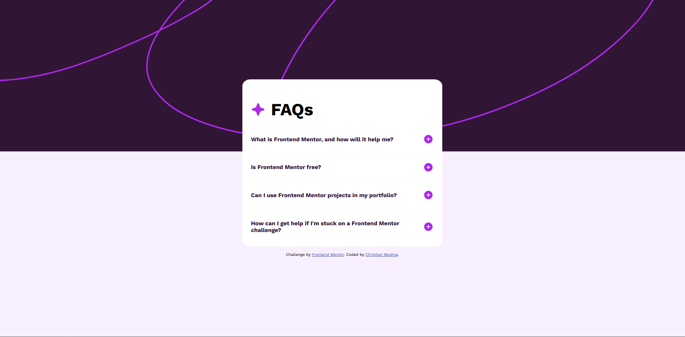

# Frontend Mentor - FAQ accordion solution

This is a solution to the [FAQ accordion challenge on Frontend Mentor](https://www.frontendmentor.io/challenges/faq-accordion-wyfFdeBwBz). Frontend Mentor challenges help you improve your coding skills by building realistic projects. 

## Table of contents

- [Overview](#overview)
  - [The challenge](#the-challenge)
  - [Screenshot](#screenshot)
  - [Links](#links)
- [My process](#my-process)
  - [Built with](#built-with)
  - [What I learned](#what-i-learned)
  - [Continued development](#continued-development)
  - [Useful resources](#useful-resources)
- [Author](#author)
- [Acknowledgments](#acknowledgments)

**Note: Delete this note and update the table of contents based on what sections you keep.**

## Overview

### The challenge

Users should be able to:

- Hide/Show the answer to a question when the question is clicked
- Navigate the questions and hide/show answers using keyboard navigation alone
- View the optimal layout for the interface depending on their device's screen size
- See hover and focus states for all interactive elements on the page

### Screenshot



### Links

- Solution URL: [Solution](https://www.frontendmentor.io/challenges/faq-accordion-wyfFdeBwBz/hub)
- Live Site URL: [Live Site](https://faq-accordion-3tu.pages.dev/)

## My process

### Built with

- Semantic HTML5 markup
- Flexbox
- [TypeScript](https://www.typescriptlang.org/)
- [Sass](https://sass-lang.com/) - For styles

### What I learned

This project was a good refresher on using event bubbling to capture events and modify elements. I made use of this concept with the accordion buttons in order to manage the expanded vs. hidden states:

```ts
document.getElementById('accordion-card')?.addEventListener('click', e => {
  if (e.target) {
    const element = e.target as Element;
    if (
      element.tagName === 'IMG' &&
      element.parentNode?.nodeName === 'BUTTON'
    ) {
      const btn = element.parentNode as HTMLButtonElement;
      const controlledDescription = document.getElementById(
        btn.getAttribute('aria-controls') as string
      ) as HTMLParagraphElement;
      const btnImage = element as HTMLImageElement;
      toggleButton(btnImage);
      toggleExpanded(btn);
      toggleVisibility(controlledDescription);
    }
  }
});
```

I also learned about the differences between offsetHeight and scrollHeight. Specifically, how offsetHeight doesn't take into account the underlying (hidden) content, whereas scrollHeight does. I was able to make use of this to check the current state of the button.

```ts
export function toggleVisibility(paragraph: HTMLParagraphElement): void {
  if (paragraph.offsetHeight === 0) {
    paragraph.style.height = `${paragraph.scrollHeight}px`;
```

### Continued development

In this project I learned a lot about some more obscure CSS attributes, such as offsetHeight and scrollHeight, for creating the accordion through TypeScript. I hope to continue learning how to make use of these attributes in future projects.

### Useful resources

- [SASS Guide](https://sass-lang.com/guide/) - This guide is great at helping newcomers get up to speed on how to use SASS / SCSS for more control over styling.
- [clientHeight vs offsetHeight vs scrollHeight](https://phuoc.ng/collection/this-vs-that/client-height-vs-offset-height-vs-scroll-height/) - A good resource for learning how to control heights of elements (specifically scrollHeight vs. offsetHeight)

## Author

- Website - [Christian Medina](https://www.github.com/cmedina-dev)
- Frontend Mentor - [@cmedina-dev](https://www.frontendmentor.io/profile/cmedina-dev)
- LinkedIn - [@cjmedina3](https://linkedin.com/in/cjmedina3)
